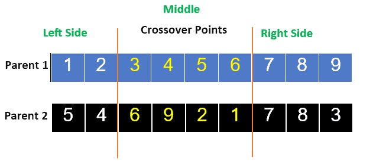
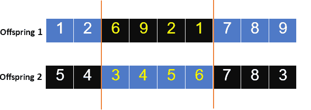
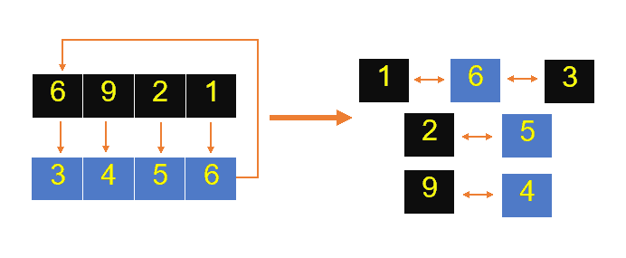
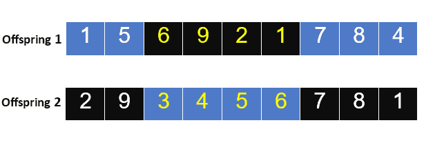
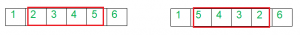
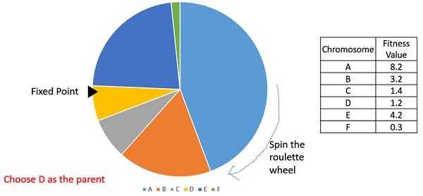
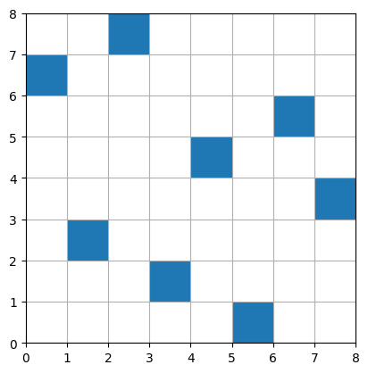

**Contents**

[1. Introduction](#introduction)

[1.1. N Queens Problem](#n-queens-problem)

[1.2. Genetic Algorithm](#genetic-algorithm)

[2. Methodology](#methodology)

[2.1. Chromosome Data structure](#chromosome-data-structure)

[2.2. Fitness Function](#fitness-function)

[2.3. Crossover Mechanism](#crossover-mechanism)

[2.3.1. Selection of Crossover Points](#231-selection-of-crossover-points)

[2.3.2. Copy the Middle Segment](#232-copy-the-middle-segment)

[2.3.3. Determine Mapping Relationship to Legalize Offspring](#233-determine-mapping-relationship-to-legalize-offspring)

[2.3.4. Legalize Offspring With the Mapping Relationship](#234-legalize-offspring-with-the-mapping-relationship)

[2.3.5. Advantages and Applications of PMX](#235-advantages-and-applications-of-pmx)

[2.4. Mutation Mechanism](#mutation-mechanism)

[2.5. Parent Selection](#parent-selection)

[2.6. Implementing the Genetic Algorithm](#implementing-the-genetic-algorithm)

[2.7. Visualization](#visualization)

[3. Conclusion](#conclusion)

# Introduction

## N Queens Problem

The N queens puzzle is the problem of placing eight chess queens on an n×n chessboard so that no two queens threaten each other; thus, a solution requires that no two queens share the same row, column, or diagonal. There are 92 solutions. The problem was first posed in the mid-19th century. In the modern era, it is often used as an example problem for various computer programming techniques.

## Genetic Algorithm

Genetic Algorithms(GAs) are adaptive heuristic search algorithms that belong to the larger part of evolutionary algorithms. Genetic algorithms are based on the ideas of natural selection and genetics. These are intelligent exploitation of random searches provided with historical data to direct the search into the region of better performance in solution space. They are commonly used to generate high-quality solutions for optimization problems and search problems.

Genetic algorithms simulate the process of natural selection which means those species that can adapt to changes in their environment can survive and reproduce and go to the next generation. In simple words, they simulate “survival of the fittest” among individuals of consecutive generations to solve a problem. Each generation consists of a population of individuals and each individual represents a point in search space and possible solution. Each individual is represented as a string of character/integer/float/bits. This string is analogous to the Chromosome.

# Methodology

## Chromosome Data structure

We use the permutation data structure for representation and we assume that there's only one queen in each row

The index number equals the row, so each chromosome is an array with the length of n and each value represents the position of queen in the specified row.

By doing so no queen can threaten any other horizontally or vertically

A choromosome would look like below which is a permutation of 0 to n

[0,1,2,3,4,5,6,7]

The values are between zero and n for the sake of simplicity.

## Fitness Function

A Fitness Score is given to each individual which shows the ability of an individual to “compete”. The individual having optimal fitness score (or near optimal) are sought.

The GAs maintains the population of n individuals (chromosome/solutions) along with their fitness scores.The individuals having better fitness scores are given more chance to reproduce than others. The individuals with better fitness scores are selected who mate and produce better offspring by combining chromosomes of parents. The population size is static so the room has to be created for new arrivals. So, some individuals die and get replaced by new arrivals eventually creating new generation when all the mating opportunity of the old population is exhausted. It is hoped that over successive generations better solutions will arrive while least fit die.

Each new generation has on average more “better genes” than the individual (solution) of previous generations. Thus each new generations have better “partial solutions” than previous generations. Once the offspring produced having no significant difference from offspring produced by previous populations, the population is converged. The algorithm is said to be converged to a set of solutions for the problem.

Because of the data structure which is permutation we only need to check for diagonal threats

The fitness function returns the number of threatened queens

0 fitness means no queens are threated

Since we need the best fitness to be more than other values we subtract maximum number of threats from the number of threatened queen

So in the case of n = 8 the best fitness is 64

We check for the diagonal threat by calculating the distance in x and y axis if the distances are the same the two queens are on the same diagonal

## Crossover Mechanism

We use the partially mapped crossover mechanism for recombination of the chromosomes because of the data structure which is a permutation so that our data structure would not be harmed in the process of recombination

The PMX is an approach that utilizes the genetic material of the two parent solutions to propose a new offspring. The principle behind PMX is that it should preserve the arrangement of genes in a parent and allow variation in genes. PMX operates in several steps as follows:

### 2.3.1. Selection of Crossover Points

In the case of PMX, one starts by randomly selecting two crossing points. These points divide the parents’ chromosomes into three segments: Left, middle, and right segmentation.

### 2.3.2. Copy the Middle Segment

Firstly, copying is done to the intermediate portion among the first parents of offspring. In this, it prevents certain genes from changing with the offspring.

### 2.3.3. Determine Mapping Relationship to Legalize Offspring

For each offspring, we’ll need to identify the genes on the left and right sides that need replacing. Also, we’ll establish a mapping relationship to determine their placement that should avoid gene redundancy and replace the gene from the first parent to its corresponding one in the second parent.

### 2.3.4. Legalize Offspring With the Mapping Relationship

Based on the relationship, we’ll find and replace genes that are repeated in each chromosome.

To provide a clear insight into how PMX works, let’s suppose that we have the following two parent solutions P1 [1, 2, 3, 4, 5, 6, 7, 8, 9] and P2 [5, 4, 6, 9, 2, 1, 7, 8, 3].

We’ll select points of crossover at 3 to 6 positions as follows (Fig 1)

Fig 1

By exchanging genes from those two parents, two new offspring will be created as follows: (Fig 2)

Fig 2

To legalize the offspring, let’s determine the mapping relationship as follows: (Fig 3)

Fig 3

This leads to offspring that contains some genes from parents in their original order, and this maintains a middle segment with its relative identity without duplications as follows: (Fig 4)

Fig 4

### 2.3.5. Advantages and Applications of PMX

Partially Mapped Crossover has several advantages:

Preservation of Order: PMX maintains the same order of genes across parents, important when there are disorders that require a sequence of genes’ order, like the Travelling salesman problem.

Exploration and Exploitation: By balancing exploration and exploitation during the search process, PMX can locate good or nearly optimal answers.

In most cases, PMX is implemented in problems that call for permutation representation, like TSP, job assignments, and so forth, in combinatorial optimization problems

## Mutation Mechanism

In Inversion Mutation we select a subset of our genes and reverse their order. The genes have to be contiguous in this case (Fig 5).



Fig 5

## Parent Selection

For our parent selection mechanism we first calculate the fitness probability of each individual by using the formula below: (Formula 1)

$$
P_{F P S} ( i ) = \frac{f_{i}}{\sum_{i = 1}^{N} f_{i}}
$$

Formula 1

Then we use the roulette wheel algorithm for selecting the parents for recombination.

Fitness Proportionate Selection is one of the most popular ways of parent selection. In this every individual can become a parent with a probability which is proportional to its fitness. Therefore, fitter individuals have a higher chance of mating and propagating their features to the next generation. Therefore, such a selection strategy applies a selection pressure to the more fit individuals in the population, evolving better individuals over time.

Consider a circular wheel. The wheel is divided into n pies, where n is the number of individuals in the population. Each individual gets a portion of the circle which is proportional to its fitness value.

Two implementations of fitness proportionate selection are possible −

Roulette Wheel Selection

In a roulette wheel selection, the circular wheel is divided as described before. A fixed point is chosen on the wheel circumference as shown and the wheel is rotated. The region of the wheel which comes in front of the fixed point is chosen as the parent. For the second parent, the same process is repeated. (Fig 6)



Fig 6

It is clear that a fitter individual has a greater pie on the wheel and therefore a greater chance of landing in front of the fixed point when the wheel is rotated. Therefore, the probability of choosing an individual depends directly on its fitness.

Implementation wise, we use the following steps:

-   Calculate S = the sum of a finesses.
-   Generate a random number between 0 and S.
-   Starting from the top of the population, keep adding the finesses to the partial sum P, till P\<S.
-   The individual for which P exceeds S is the chosen individual.

## Implementing the Genetic Algorithm

At last we implement the genetic algorithm by using the code below.

In this section we first create the initial population which is a list of permutations, then we calculate the fitness of each individual if any of the individuals have the required fitness we return it as the answer if not the algorithm enters a loop which ends only if the individual with the required fitness is found.

In the loop we first use the recombination algorithm on all the parents then we mutate some of the individual randomly, at last we select the best parents for the next recombination process and calculate the fitness of the selected parents.

When the answer is found the plot of the answer is drawn and the answer is returned. ( code 1)

```
  def genetic_n_queens(n: int, initial_population: int, chromosom: list):
    population = [np.random.permutation(chromosom) for i in range(initial_population)]
    fitnesses = [fitness(individual) for individual in population]
    if (n**2) in fitnesses:
        return population[fitnesses.index(64)]
    while (n**2) not in fitnesses:
        print("new generation ... ")
        offsprings = []
        print("recombination ...")
        for i, chromosom1 in enumerate(population):
            for j, chromosom2 in enumerate(population):
                if i == j : continue
                offspring1, offspring2 = PMX_crossover(np.array(chromosom1), np.array(chromosom2), n)
                offsprings.append(offspring1)
                offsprings.append(offspring2)
        population.extend(offsprings)
        population = np.array(population)
        population = population.tolist()
        offsprings = []
        print("mutations ... ")
        for i, parent_mutate in enumerate(population):
            mutate_prob = random.randint(0,1)
            if mutate_prob == 1:
                offspring_mutate = mutate(parent_mutate, n)
                offsprings.append(offspring_mutate)
        population.extend(offsprings)
        population = np.array(population)
        population = population.tolist()
        fitnesses = [fitness(individual) for individual in population]
        population = parent_selection(population, fitnesses, initial_population)
        fitnesses = [fitness(individual) for individual in population]
        print(population)
        plot_solution(population,n)
    
    return population[fitnesses.index(64)]
```

Code 1

## Visualization

We use the code below to visualize and plot the answers in different stages of the algorithm including the final answer (code 2)

```
def plot_solution(solutions, n) -> None:
    """Given a solution, plot it and save the result to disk."""
    fig = plt.figure()
    ax = fig.add_subplot(111, aspect='equal')
    ax.set_xlim((0, n))
    ax.set_ylim((0, n))

    count = 0
    plt.grid()
    for solution in solutions:
        for queen in solution:
            ax.add_patch(patches.Rectangle((queen, count), 1, 1))
            count += 1
        plt.show()
```

Code 2

An Example of the plotted answer is demonstrated below: (fig 7)



Fig 7

# Conclusion

The genetic algorithm is part of the evolutionary algorithms that help us find the best answer for the np-hard questions with a very large solution space in a very shorter time than the greedy algorithms.

In this exercise we demonstrated how to implement the genetic algorithm and understood the efficiency of this algorithm in case of simplicity of implementation and small time complexity.
